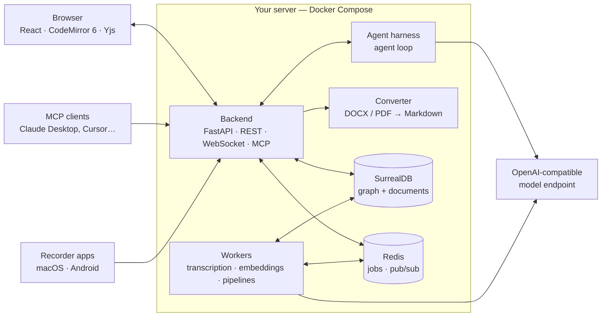

<div align="center">

# Lore

**A self-hosted knowledge base for worldbuilders, writers and small studios — a real-time collaborative Markdown editor built around a linked graph of documents, with an AI agent that works inside your project.**

[](https://github.com/kreolsky/lore-knowledge-creator/tags)
[](#license)
[](https://github.com/kreolsky?tab=packages&repo_name=lore-knowledge-creator)
[](#install)

[Features](#features) · [Install](#install) · [AI agent](#an-ai-agent-that-lives-in-your-project) · [Architecture](#architecture) · [License](#license)

</div>

<!-- Hero screenshot goes here: assets/readme/hero.png (editor + document tree + chat) -->

## Why Lore

A setting, a campaign or a game design grows into hundreds of pages that reference each other: characters, places, factions, timelines, rules, meeting notes, audio from playtests. Wikis are rigid, note apps are single-player, and chat assistants forget everything between conversations.

Lore keeps all of it in one place, as a **graph of Markdown documents** that a team edits together in real time — and gives you an **AI agent that reads, searches and edits that graph** with the same permissions you have, asking before it changes anything you care about.

You run it on your own server. Your texts never leave it except to the model provider you configure.

## Features

### Writing and structure

- **Live-preview Markdown editor** (CodeMirror 6): headings, tables, checklists, images, code, **KaTeX math** and **Mermaid diagrams** render in place while the source stays plain Markdown.
- **Documents in a tree**, ordered by hand, with drag-and-drop and keyboard navigation.
- **Links everywhere**: link documents, headings, notes and files; hover any link for a preview. Mentions are tracked as a graph, so every document knows what points at it.
- **Transclusion**: embed one document inside another; exports inline the embedded content.
- **Editable tables** as first-class blocks inside documents.
- **Export** any document to Markdown, DOCX or PDF.

### Working together

- **Real-time co-editing** on CRDTs (Yjs): no locks, no merge conflicts, remote cursors in the gutter, safe reconnects after a network blip.
- **Comments anchored to text**, with threaded discussion right next to the passage.
- **Version history**: automatic checkpoints and snapshots; restore any earlier version.
- **Access control per project**: owner, full access, commentator, read-only; invite links for new members.
- **Public read-only links** to a single document or a whole subtree — no account needed to read.

### Files, audio and voice

- **References**: attach images, PDFs, Word documents and audio to the project; each file carries its own text.
- **Automatic conversion**: DOCX and PDF become editable Markdown; audio is **transcribed**; images get thumbnails.
- **Voice input** in the editor and the chat (`Cmd+D`).
- **Recorder apps**: a macOS menu-bar recorder and an Android app send voice notes and meeting recordings straight into a project for transcription.

### An AI agent that lives in your project

The chat panel is a full agent loop, not a text box bolted onto an editor. It works on your documents with your permissions:

- **Reads and searches the project**: semantic search over documents and files, the project outline, any document by link.
- **Writes and edits**: creates documents, applies targeted edits, fills tables, moves and renames — with **approve / reject per change** when you want to stay in control.
- **Project memory**: the agent keeps durable facts about your world as documents you can read and correct.
- **Skills**: reusable instructions the agent loads on demand; the agent can write new ones for itself.
- **Web search**, **image generation** (ComfyUI) and an optional **sandboxed shell** for scripts and data work.
- **Personas**: switch the system prompt per chat session.
- Works with **any OpenAI-compatible endpoint** — hosted models or your own (LiteLLM, vLLM, llama.cpp, Ollama behind a proxy).

### Automation and integrations

- **MCP server**: connect Claude Desktop, Cursor or any MCP client to a project with a scoped key — external agents get the same tools, limited to the documents you allow.
- **Pipelines**: background jobs such as structured data extraction from transcripts, on demand or on a schedule.
- **REST API** with an OpenAPI schema (`openapi.json`).

### Yours to run

- **Self-hosted**: one Docker Compose file, no configuration needed to start.
- Light and dark themes, English and Russian interface.

<!-- Screenshot gallery goes here: assets/readme/*.png (editor, links + preview, agent chat with approvals, comments, history) -->

## Install

Everything below is written to be followed literally — by a person or by an AI agent. Each step is a command followed by the check that proves it worked.

**Requirements:** Docker Engine with Docker Compose **v2.24 or newer** (`docker compose version`), and a free TCP port 8080.

### 1. Download and start

```sh
mkdir lore && cd lore
curl -fsSLO https://raw.githubusercontent.com/kreolsky/lore-knowledge-creator/main/docker-compose.yml
docker compose up -d
```

No configuration file is needed. The first start downloads the images and takes a few minutes.

### 2. Check that it runs

```sh
curl -s http://localhost:8080/api/health
```

Expected: a JSON object containing `"status":"ok"`. Until the backend has finished starting, the request fails or returns an error page — repeat it after 15 seconds. `"harness":"unconfigured"` is normal: it only means the AI agent is not enabled yet.

### 3. Sign in

Open http://localhost:8080 and sign in:

| Email | Password |
|---|---|
| `admin@lore.app` | `lore-admin` |

**Change this password right away** (**Profile settings**). Anyone who can reach the port can try the default.

That is a complete install: the editor, collaboration, files and document conversion all work without AI.

### Settings

Settings go into a file named `.env` next to `docker-compose.yml`, one `NAME=value` per line. Apply them with `docker compose up -d`.

| Variable | Default | What it does |
|---|---|---|
| `LORE_PORT` | `8080` | Port the web interface listens on |
| `LORE_VERSION` | latest release | Pin a release, e.g. `v0.21.0` |
| `LORE_ADMIN_USERNAME` | `admin` | First admin, created once on the first start; the login is `<username>@lore.app` |
| `LORE_ADMIN_PASSWORD` | `lore-admin` | Password of that first admin; has no effect after the first start |
| `COOKIE_SECURE` | `false` | Set to `true` when Lore is served over HTTPS |
| `LORE_SECRET_KEY` | generated | Session signing key; generated on the first start and kept in the data volume |

Every other setting is documented in [`.env.example`](.env.example).

### Enable AI

Lore talks to any **OpenAI-compatible API** (a hosted provider, or your own models behind LiteLLM, vLLM, llama.cpp, Ollama…).

**Transcription and semantic search** need no restart: sign in as admin, open **Admin panel → Models & APIs**, set the API base URL and key, and set the speech-to-text and embedding model names to models your endpoint serves.

**The AI agent (chat)** runs in an extra service. Create `.env` next to `docker-compose.yml`:

```sh
AI_API_URL=https://your-endpoint.example/v1
AI_API_KEY=your-key
HARNESS_MODEL=model-id-your-endpoint-serves
HARNESS_DRIVER_SECRET=any-long-random-string
```

(`openssl rand -hex 32` prints a good value for `HARNESS_DRIVER_SECRET`.) Then start with the `ai` profile:

```sh
docker compose --profile ai up -d
```

The first run builds the agent service from this repository and takes several minutes. Check it with `curl -s http://localhost:8080/api/health`: the response now contains `"harness":"reachable"`.

### Troubleshooting

| Symptom | Check | Fix |
|---|---|---|
| `docker compose up` fails with `address already in use` or `port is already allocated` | another service uses 8080 | put `LORE_PORT=8090` (any free port) in `.env`, run `docker compose up -d`, use that port |
| `env_file` / `required` error on `up` | `docker compose version` | upgrade Docker Compose to v2.24 or newer |
| health never returns `"status":"ok"` | `docker compose logs backend` | the log names the failing setting or service |
| `"harness":"unreachable"` after enabling AI | `docker compose --profile ai logs harness` | if the log says the title model *advertises reasoning effort levels*, add `CHAT_TITLE_MODEL=` with a non-reasoning model your endpoint serves, then `docker compose --profile ai up -d` |
| forgot the admin password | — | put `LORE_ADMIN_USERNAME=admin2` and `LORE_ADMIN_PASSWORD=<new password>` in `.env`, run `docker compose up -d`; sign in as `admin2@lore.app` and set a new password for the old admin in **Admin panel** |

### Update

```sh
docker compose pull
docker compose up -d
```

With the AI agent enabled, also rebuild it: `docker compose --profile ai up -d --build harness`.

### Data and backups

All data lives in Docker volumes named `lore_surreal` (database), `lore_storage` (uploaded files and the session key) and `lore_redis`. `docker compose down` keeps them; `docker compose down -v` **deletes everything**. To back up, stop the stack and archive the volumes:

```sh
docker compose stop
docker run --rm -v lore_surreal:/surreal -v lore_storage:/storage -v "$PWD":/backup alpine \
  tar czf /backup/lore-backup.tar.gz /surreal /storage
docker compose start
```

## Architecture



- **Frontend**: TypeScript, React, Zustand, CodeMirror 6, Yjs, Tailwind, Vite.
- **Backend**: Python, FastAPI, Pydantic; background jobs on arq/Redis.
- **Database**: SurrealDB — documents, links and access rules live in one graph.
- **Agent**: the agent loop runs in a separate harness service built on [deepseek-harness](https://github.com/deepseek-ai/deepseek-harness) (vendored as `vendor/dsh`); Lore owns identity, permissions, storage and the tools.
- The backend is the only authority: every tool call — from the chat, the MCP server or a recorder app — passes the same permission check.

## Contributing and security

Lore is developed in a private repository and published here as release snapshots: one commit per release. Issues — bug reports, questions, ideas — are welcome; pull requests are not accepted yet (see [CONTRIBUTING.md](CONTRIBUTING.md)). To report a vulnerability, see [SECURITY.md](SECURITY.md).

## License

Lore is **source-available** under the [Business Source License 1.1](LICENSE). It is not an OSI-approved open source license. Each version automatically converts to the **Apache License 2.0** four years after it is published.

### Free to use

You can use Lore in production for free, with no feature limits, if you and your affiliates (parent companies and subsidiaries) meet **all** of the following:

- less than **USD 1M gross revenue** in the last 12 months;
- less than **USD 1M total outside funding** raised;
- no more than **25 people** working for you, counting employees and contractors.

Individuals, non-profits, schools and universities, and any non-commercial use are always free, whatever their size. Evaluation, development and testing are free for everyone.

### Needs a commercial license

- Organizations above any of the thresholds above.
- **Anyone, of any size**, offering Lore to third parties as a hosted or managed service.

If your studio grows past a threshold, you have **90 days** to get a commercial license. Contact: zaigraeff@gmail.com.

### Examples

| Situation | License |
|---|---|
| A 6-person indie studio, $300k revenue, self-funded | Free |
| A solo writer building a setting for a novel | Free |
| A 12-person studio that got a $400k advance from a publisher | Free (a publisher advance counts as revenue, not funding) |
| A 10-person startup that raised a $3M seed round | Commercial |
| A studio owned by a large publisher, even if the studio is small | Commercial (affiliates count) |
| A company hosting Lore for its customers | Commercial |

Third-party components and their licenses are listed in [NOTICE](NOTICE). The document converter service in `converter/` is licensed separately under the [GNU AGPL v3.0](converter/LICENSE).
